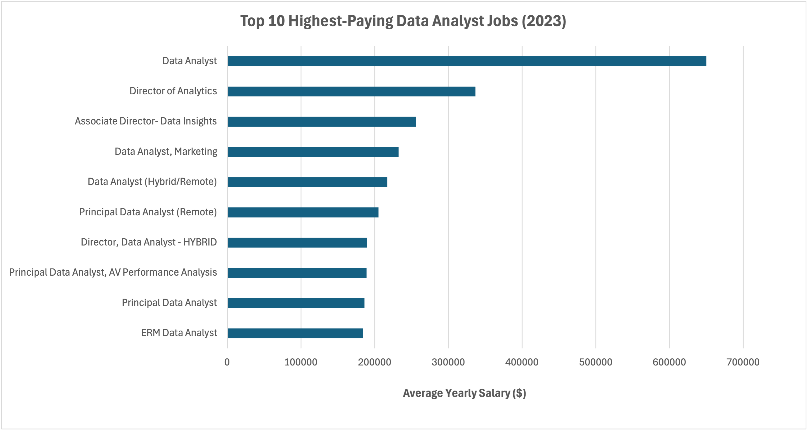

## 📊 Introduction
This project dives into the **data analyst job market** using SQL as the primary tool of investigation.  
The aim is to uncover:  
- 💰 The **highest-paying jobs** for data analysts  
- 🔥 The **most in-demand skills** in the industry  
- 📈 The **skills that strike a balance** between being in high demand and offering high salaries  

By writing carefully structured SQL queries, I transformed raw job posting data into **actionable insights**. These findings can help guide **career development decisions**, inform **skill-building strategies**, and provide a clearer picture of the evolving landscape for data analysts.  

---

## 🎯 Background
The motivation behind this project came from my own curiosity:  

> *If I were preparing for a career in data analytics, what jobs and skills should I target to maximize both employability and salary potential?*  

To answer that, I focused on five key questions:  
1. **What are the top-paying data analyst jobs?**  
2. **What skills are required for these top-paying jobs?**  
3. **Which skills are most in demand overall?**  
4. **Which skills are associated with higher salaries?**  
5. **What are the most “optimal” skills — those that combine high demand with high pay?**  

The dataset used for this project was provided by [Luke Barousse’s SQL Course](https://lukebarousse.com/sql). It included:  
- Job postings with details on **title, company, location, salary, and posting date**  
- Skills associated with each job (e.g., SQL, Python, Tableau)  
- Metadata linking jobs ↔ skills ↔ companies  

This data gave me a unique opportunity to replicate a **real-world analytics workflow**: asking business questions → querying a database → analyzing results → presenting findings.  

---

## 🛠️ Tools I Used
This project combined SQL analysis with modern development tools:  

- **SQL** – the backbone of the analysis, used to filter, aggregate, and join tables.  
- **PostgreSQL** – database engine managing the job postings dataset.  
- **Visual Studio Code (VS Code)** – my development environment for writing and testing SQL queries.  
- **Git & GitHub** – version control and collaboration, used to track query development and host this project.  

---

## 🔎 The Analysis

### 1️⃣ Top Paying Data Analyst Jobs
**Question:** What are the 10 highest-paying remote data analyst roles?  

**Approach:**  
- Filtered for job postings with the title *Data Analyst*, a specified salary, and remote availability.  
- Sorted results by average yearly salary.  
- Limited results to the top 10.  

**Findings:**  
- Salaries ranged from **$184,000 → $650,000**.  
- Employers included major firms like **SmartAsset, Meta, and AT&T**.  
- Job titles varied (e.g., *Data Analyst, Senior Analyst, Director of Analytics*), showing a wide spectrum of responsibilities under the “Data Analyst” label.  

  
*Figure 1: Salary distribution for the top 10 highest-paying remote Data Analyst roles in 2023.*

---

### 2️⃣ Skills for Top Paying Jobs
**Question:** What skills are required for the highest-paying jobs?  

**Approach:**  
- Created a CTE of the top 10 paying jobs (from query 1).  
- Joined this with the skills tables to list technical skills for each job.  

**Findings:**  
- **SQL** appeared in 8 out of 10 roles → the single most critical skill.  
- **Python** appeared in 7 jobs, showing the industry’s strong demand for programming.  
- **Tableau** (6 jobs) emphasized the importance of data visualization.  
- Other skills included **R, Snowflake, Pandas, and Excel**, highlighting a mix of database, programming, and reporting tools.  

---

### 3️⃣ In-Demand Skills
**Question:** Which skills are requested most frequently overall?  

**Approach:**  
- Counted skill occurrences across all job postings for *Data Analyst*.  
- Grouped results by skill name.  
- Ordered by frequency.  

**Findings:**  
The top 5 in-demand skills were:  
| Skill   | Demand Count |  
|---------|--------------|  
| SQL     | 7,291        |  
| Excel   | 4,611        |  
| Python  | 4,330        |  
| Tableau | 3,745        |  
| Power BI| 2,609        |  

This reveals that **SQL and Excel remain foundational**, while **Python and visualization tools (Tableau, Power BI)** are increasingly required for analytics storytelling.  

---

### 4️⃣ Skills Based on Salary
**Question:** Which skills are associated with higher average salaries?  

**Approach:**  
- Calculated the average yearly salary for jobs requiring each skill.  
- Rounded results for readability.  
- Ranked skills by salary.  

**Findings:**  
- **Big Data & ML Tools** (PySpark, Couchbase, DataRobot, Jupyter) ranked at the top.  
- **Cloud & Infrastructure Skills** (Databricks, GCP, Elasticsearch, Kubernetes) commanded higher salaries.  
- **Python libraries** (Pandas, NumPy) also showed high value.  

This indicates that specialized, technical skills in **data engineering and ML pipelines** can significantly boost earning potential.  

---

### 5️⃣ Most Optimal Skills
**Question:** Which skills combine high demand *and* high salaries?  

**Approach:**  
- Built two CTEs:  
  - `skills_demand` → demand count per skill  
  - `average_salary` → average salary per skill  
- Joined them to align demand with salary.  
- Ranked by both demand and salary.  

**Findings:**  
- **SQL**: High demand and competitive pay → foundational and irreplaceable.  
- **Python & R**: Widely demanded and decently paid.  
- **Cloud & Big Data skills** (Snowflake, AWS, Azure, BigQuery): Provide the “salary boost” edge.  
- **Visualization Tools** (Tableau, Looker, Power BI): Required for practical business use cases.  

These results show that the most **optimal skill set** balances:  
- Core fundamentals (SQL, Excel)  
- Programming (Python, R)  
- Visualization (Tableau, Power BI)  
- Cloud/Big Data (Snowflake, PySpark, AWS)  

---

## 📚 What I Learned
Through this project, I gained both **technical SQL skills** and **practical analytics experience**:  

- 🧩 **Complex Query Crafting** – mastered CTEs, multiple joins, and filtering conditions.  
- 📊 **Aggregation & Summaries** – used `COUNT`, `AVG`, `ROUND` to derive insights from job postings.  
- 💡 **Analytical Thinking** – converted vague business questions into SQL logic.  
- 🔄 **Version Control** – used GitHub to manage iterations of queries and track my progress.  

---

## 📈 Insights
Here’s a summary of what the data revealed:  
1. **Remote analyst roles can pay extremely high salaries** (up to $650k).  
2. **SQL is the #1 skill** → it’s both the most demanded and required for top-paying roles.  
3. **Python + Visualization tools** are crucial companions for data storytelling.  
4. **Big Data & Cloud tools** (PySpark, Databricks, AWS) are the future differentiators for higher salaries.  
5. An **optimal skill set** combines fundamentals with advanced, modern tools.  

---

## ✅ Conclusion
This project confirmed the importance of SQL as a cornerstone skill while highlighting how additional tools (Python, Tableau, Cloud platforms) elevate both **demand** and **salary potential**.  

For aspiring analysts, the roadmap is clear:  
1. **Master SQL and Excel** – the foundation.  
2. **Add Python & BI tools** – for versatility.  
3. **Learn Cloud & Big Data tools** – to stay ahead of industry trends.  

Ultimately, the job market rewards **continuous learning and adaptability**. This project was not just about answering questions with SQL — it was about building a framework for **data-driven career planning**.  

### ✨ Created by Nadia Rozman | September 2025
